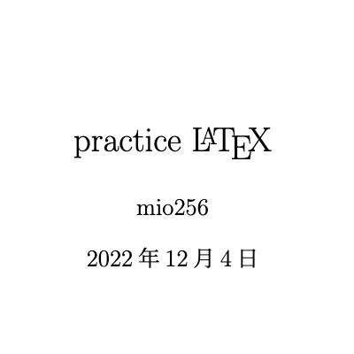

# practice_latex

## Overview

- practice repo for latex

## Requirement

- latex

[VSCode で最高の LaTeX 環境を作る](https://qiita.com/rainbartown/items/d7718f12d71e688f3573)

## Usage

- for sample

## Features

- simple
- sample

## Reference

[LATEX 入門 - 明治大学](https://www.isc.meiji.ac.jp/~mizutani/tex/latex_manual/latex.pdf)

[LaTeX入門 - 数式コマンドリファレンス](https://medemanabu.net/latex/)

## Author

[mio256](https://github.com/mio256)

## Licence

MIT License